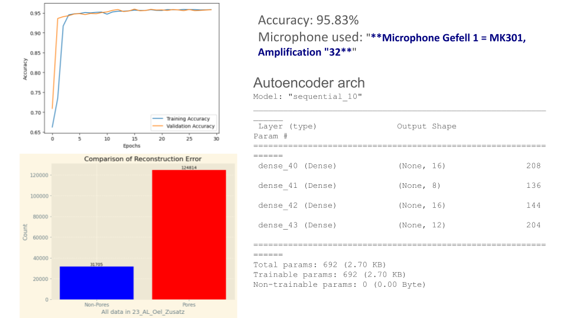

# Neural Networks : WS23/24 Project
### Introduction : The Acoustic Weld Inspection Project (AKoS) 

- Submitted by Shashwat Pandey (spande2s), Talha Riyaz Shaikh (tshaik2s)

The Acoustic Weld Inspection Project (AKoS) enhances weld seam quality assurance for safety-critical components using innovative machine learning, particularly autoencoders. It addresses limitations in traditional methods like visual examination and ultrasonic testing. AKoS leverages acoustic data to develop a robust system for accurate anomaly detection in weld seams. It aims to develop a non-destructive testing (NDT) method for welding seams in safety-critical components.

## Solution Overview

The proposed solution leverages autoencoders, a type of neural network designed for unsupervised learning. Autoencoders consist of an encoder and a decoder, with the primary objective of learning a compressed representation of input data. In the context of AKoS, this compressed representation captures essential features of acoustic signals associated with normal weld seams
The proposed solution utilizes autoencoders, a neural network architecture tailored for unsupervised learning, to encapsulate crucial characteristics within acoustic signals associated with normal weld seams in AKoS. The workflow involves:

1. **Data Understanding:**
   - Analyzing the frequency representation of acoustic signals through Power and Mel spectrograms for only the files associated with "**Microphone Gefell 1 = MK301, Amplification "32**"

2. **Feature Extraction:**
   - Mel Spectrogram: A frequency-domain representation of the signal's spectrum, emphasizing the distribution of energy across different frequency bands.
   - Pore Amplitude Feature: Captures amplitude information within specified frequency ranges associated with pores or defects in weld seams.
   - Spectral Contrast Feature: Measures the difference in amplitude between peaks and valleys in the spectrum, with statistical descriptors (mean and standard deviation) computed for added context.
   - Statistical Descriptors: Computes mean and standard deviation for spectral contrast
   - Feature Vector: Combines mel spectrogram, pore amplitude, and statistical descriptors
   - Length Adjustment: Zero-pads or truncates feature vectors for consistent length
   - Output: Returns a matrix with the extracted features

3. **Scaling and Feature Agglomeration Application:**
   - Applying scaling and feature agglomeration techniques to enhance data representation.

4. **Autoencoder Training (Normal Data - Non-Pore):**
   - Training the autoencoder on only the normal data to capture inherent patterns.

5. **Testing and Evaluation:**
   - Assessing the model's performance based on reconstruction errors
    - First take a test signal, find reconstruction error compare it with the reconstruction error of known signal (non-pore). 
    - Check if the reconstruction error is high, it's understandable that this signal is not known to the model so its an anomaly or in this case ( a pore) 

6. **Classification Comparison:**
   - Comparing reconstruction errors for Pore and Non-Pore classification.
   
 
 

   

## Further Investigations

Despite the success demonstrated by the autoencoder, with accuracy of **95.83%** the report suggests avenues for further investigations. For example in different microphones other than  "**Microphone Gefell 1 = MK301, Amplification "32**" having different frequency than 96khz. Also, these include an extended analysis of pore distribution, exploration of audible cues from pores, and the application of existing techniques for pore recognition. These investigations aim to enhance the model's capabilities for a more comprehensive weld inspection.

## Conclusion

In conclusion, the Acoustic Weld Inspection Project introduces a novel approach to weld seam inspection. By leveraging autoencoders and advanced machine learning techniques, the project demonstrates the potential for significantly improving defect detection in safety-critical components. Ongoing research and investigations will contribute to refining the proposed approach and establishing it as a reliable tool for quality assurance in welding applications.This project, utilizing autoencoders, shows promising results for detecting defects in weld seams. The developed solution offers a reliable method for quality assurance in safety-critical components. Ongoing research and investigations will contribute to refining and enhancing the proposed approach for more robust weld inspection.

## References: 
These are the references and where we utilized them
1. https://github.com/aldente0630/sound-anomaly-detection-with-autoencoders/tree/main - 
    - We got the basic idea behind this anomaly detection from here. 
    - We also tried to understand their feature extraction also which was very helpful for the purpose of this project
    - The autoencoder architecture used by them was useful to figure out the right bottleneck layer

2. https://chat.openai.com/ - 
    - How to effectively improve accuracy when the data was overfitting and what strategies are possible to tune the hyperparameters
    - For drafting some parts of this report on Markdown and using proper scientific terms
3. 0_read_i32.py -
    - Original file used to read the audio signals, we referenced this to read the files needed to make our Normal data
4. Anomalous Sound Detection using unsupervised and semi-supervised autoencoders and gammatone audio representation - https://arxiv.org/abs/2006.15321 -
    - Understanding the architecture and how to build autoencoders for unsupervised learning
5. Deep Autoencoders for Acoustic Anomaly Detection: Experiments with Working Machine and In-Vehicle Audio - https://repositorium.sdum.uminho.pt/bitstream/1822/81433/1/aeaad2.pdf
    - Formulating the algorithm for using autoencoders in anomaly detection